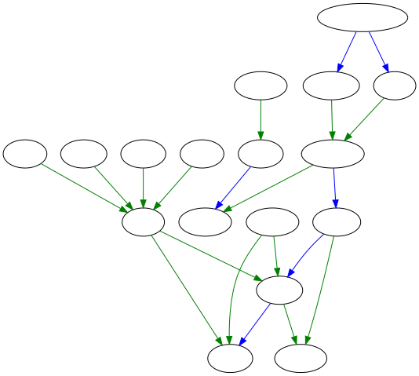

:toc:
:toc-title: الرجال
:imagesdir: .

== تراجم

include::ابن-شهاب.adoc[leveloffset=+2]

include::عمر-بن-عبد-العزيز.adoc[leveloffset=+2]

include::عروة-بن-الزبير.adoc[leveloffset=+2]

include::المغيرة-بن-شعبة.adoc[leveloffset=+2]

include::أبو-مسعود.adoc[leveloffset=+2]

== أنساب

image::أنساب.svg[]

== صلة

